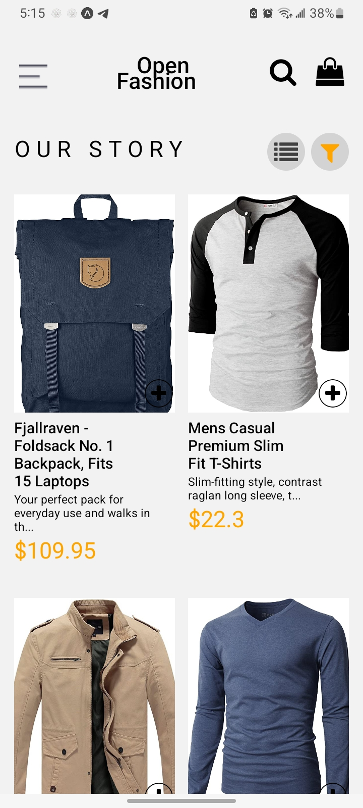
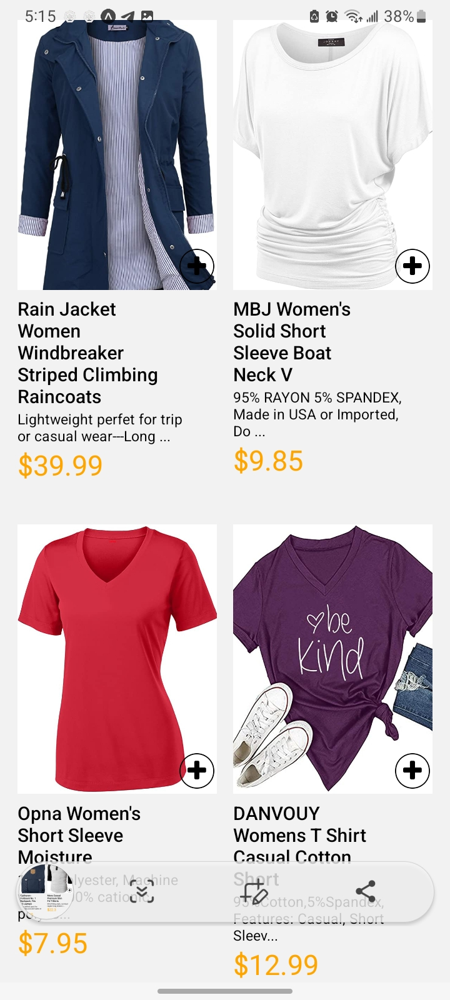
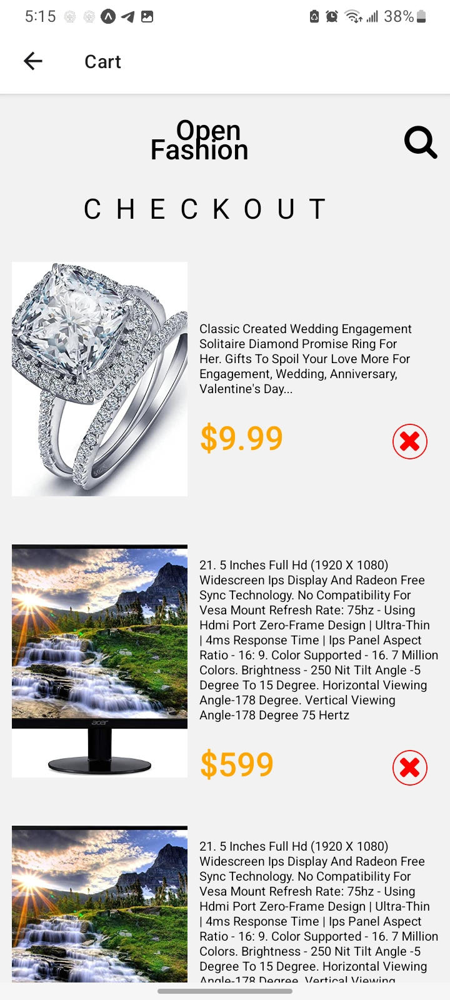
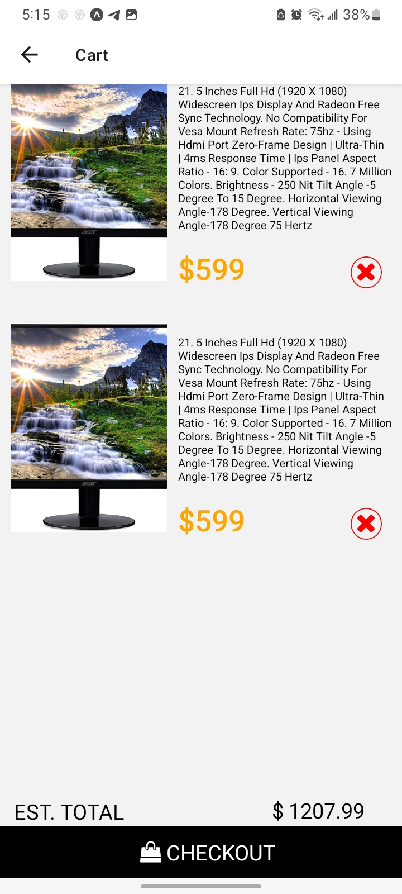
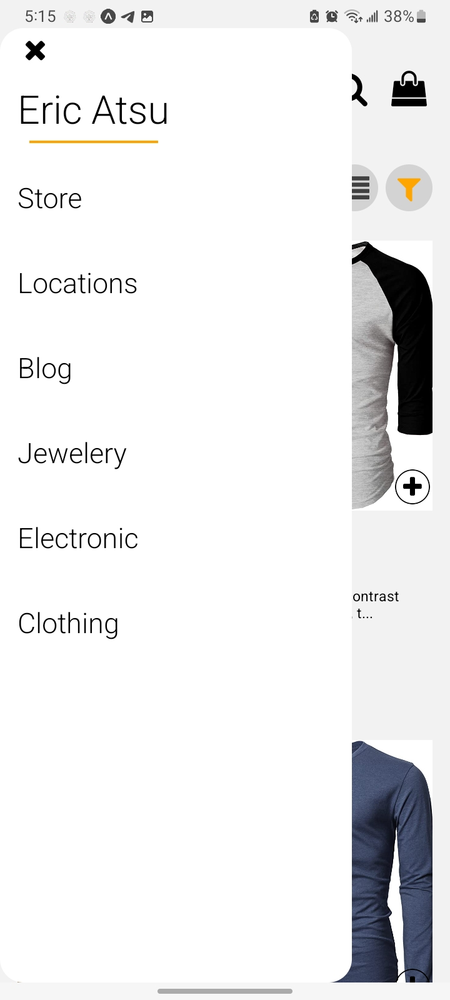
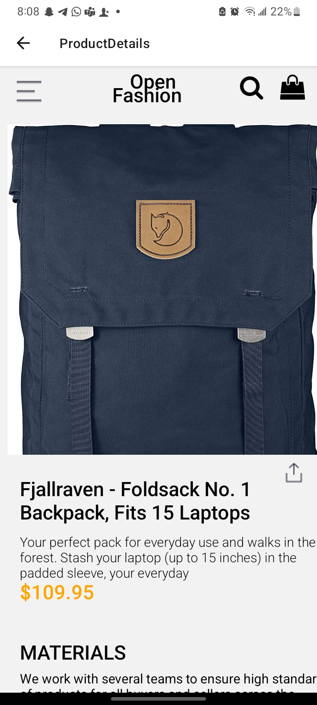
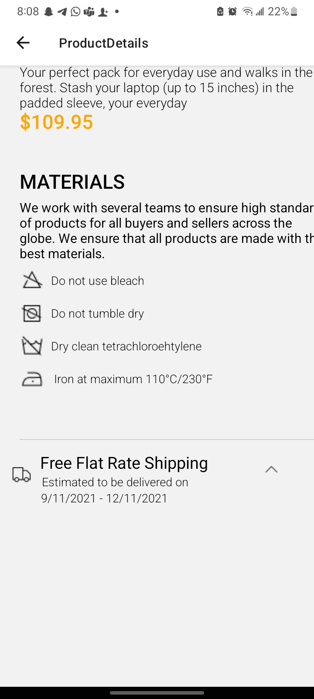

# rn-assignment7-11317254

## Brief Description of Each Component.

**CartScreen.js**: This component is responsible for displaying the items that a user has added to their shopping cart. It begins by importing necessary dependencies, including React hooks, navigation components, and local storage utilities. Upon mounting, it fetches the cart items from AsyncStorage and parses them into a state variable. The cart items are displayed in a list, where each item shows an image, name, description, and price. Users have the option to remove items from the cart, which updates both the state and AsyncStorage. Additionally, the component calculates the total price of the items in the cart and displays it prominently, ensuring that users can easily see the cost of their intended purchases.

**HomeScreen.js**: This component serves as the main interface for users when they open the app. It displays a list of products that are fetched from an external API upon mounting. The screen includes a header with a menu button, a search icon, and a shopping bag icon that navigates to the cart screen. Products are displayed in a scrollable list with images, names, descriptions, and prices. Users can click on a product to view its details on a separate screen or add it directly to their cart. The component also features a modal menu that provides additional navigation options, enhancing the app's usability. The descriptions of products are shortened to improve the user interface, ensuring that only relevant information is shown at a glance.

**Drawer**: The drawer includes several menu items such as "Store," "Locations," "Blog," "Jewelry," "Electronics," and "Clothing." Each of these options directs the user to different parts of the app, making it easier to explore various categories and features without cluttering the main interface. The drawer also displays the user's name and a decorative divider, adding a personalized touch to the navigation experience. This drawer functionality is implemented using a modal that slides in and out, providing a smooth and visually appealing transition. By consolidating navigation options into a single accessible menu, the drawer helps maintain a clean and organized layout on the HomeScreen, allowing users to focus on browsing products and other primary activities.

**ProductDetails.js**: This component is designed to show detailed information about a specific product that a user selects from the HomeScreen. When a product is clicked, the app navigates to this screen, passing the product data via navigation parameters. The component then displays the product's image, name, description, and price in a detailed view. It also includes a menu button for additional navigation options and a back button to return to the previous screen. The ProductDetails component ensures users can make informed decisions by providing comprehensive details about each product. It maintains consistency in the app's design and navigation, contributing to a smooth and intuitive user experience.

## Screenshots of the App

